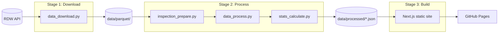

# AI Assistant Rules

> Dense guidance for Claude, Copilot, and other AI assistants.

## Architecture

**Pipeline discipline**: Stages run sequentially. Stage N must succeed before Stage N+1 runs.

## Commands

Run these from indicated directory. All are safe to auto-run.

| Action | Command |
|--------|---------|
| Install Python deps | `cd scripts && uv sync` |
| Run Python script | `cd scripts && uv run python script_name.py` |
| Format Python | `cd scripts && uv run ruff format` |
| Add Python dep | `cd scripts && uv add package_name` |
| Install web deps | `cd web && npm install` |
| Run dev server | `cd web && npm run dev` |
| Build static site | `cd web && npm run build` |
| Lint TypeScript | `cd web && npm run lint` |

## Project Structure

| Path | Purpose |
|------|---------|
| `scripts/` | Stage 1-2: Python data pipeline |
| `web/` | Stage 3: Next.js static site |
| `data/parquet/` | Raw RDW data (gitignored) |
| `data/processed/` | JSON for web (gitignored) |
| `docs/` | All documentation |

## Tech Stack

- Python 3.11+ (managed via uv, config in `scripts/`)
- Polars for data processing: LazyFrames (`scan_*`) and native functions are **mandatory**; actively refactor any Python loops or dicts to Polars-native code
- Memory constraint: full dataset cannot fit in memory; always use streaming/lazy processing
- Next.js 16, Tailwind CSS 4.1, Node.js 22+
- `.env` stores the RDW app token; never commit it

## Code Standards

### Naming Convention: `<subject>_<verb>`

| Type | Good | Bad |
|------|------|-----|
| Files | `data_download.py`, `stats_calculate.py` | `downloadData.py`, `calculate_stats.py` |
| Functions | `dataset_fetch()`, `json_save()` | `fetchDataset()`, `saveJson()` |
| Variables | `brand_stats`, `model_data` | `brandStats`, `data` |

### Rules

- File size: hard cap 400 LOC; split early
- Language: English everywhere except RDW field names (stay Dutch, exactly as provided)
- Python: type hints + docstrings required; format with Ruff before commit
- TypeScript: strict mode, no `any`, no `console.log` in production
- No emojis, no mock data, minimal logging (no timestamps)

## Boundaries

| Always | Ask First | Never |
|--------|-----------|-------|
| Preserve RDW column names exactly | Adding new dependencies | Rename/normalize RDW fields |
| Update `docs/data_mapping.md` when using new fields | Major architecture changes | Commit `.env` or secrets |
| Run formatter before commit | Modifying CI/CD config | Use mock/invented data |
| Keep files under 400 LOC | | Print date/time in logs |

## RDW API

Base URL: `https://opendata.rdw.nl/resource/{id}.json`

| Dataset | ID | Incremental Date Field |
|---------|----|-----------------------|
| Gekentekende Voertuigen | `m9d7-ebf2` | `datum_tenaamstelling` |
| Meldingen Keuringsinstantie | `sgfe-77wx` | `meld_datum_door_keuringsinstantie` |
| Geconstateerde Gebreken | `a34c-vvps` | `meld_datum_door_keuringsinstantie` |
| Gebreken | `hx2c-gt7k` | `ingangsdatum_gebrek` |
| Brandstof | `8ys7-d773` | (none - full download + merge) |

## Feature Flags

GitHub repo variables (Settings > Secrets and variables > Actions > Variables):

| Variable | Description |
|----------|-------------|
| `INSPECTION_DAYS_LIMIT` | When set (e.g., `365`), limits Stage 1 to past N days of inspections |

## Documentation

| File | Content |
|------|---------|
| `docs/ai-rules.md` | This file: AI guidance, architecture, commands |
| `docs/api-limits.md` | RDW rate limits and pagination |
| `docs/data_mapping.md` | RDW field names and pipeline output formats |
| `docs/metrics.md` | Reliability formulas, age brackets, thresholds |
| `docs/requirements.md` | Project requirements and acceptance criteria |
| `docs/todo.md` | Task tracking (update before/after work) |
| `docs/troubleshooting/` | Issue logs: `YYYY-MM-DD_<slug>.md` format |

Keep docs current. Priority: update docs before any other work.

## Verification Workflow

1. Run changes locally
2. Commit and push
3. Watch GitHub Actions until green
