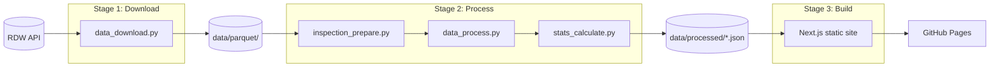

# AI Assistant Rules

> Dense guidance for Claude, Copilot, and other AI assistants.

## Critical Rule

> [!CAUTION]
> **All frontend data and constants MUST derive from backend JSON.**
> Never hardcode values (filter ranges, fuel types, age brackets, thresholds, labels, etc.) in frontend code. The Python pipeline calculates dynamic values (min/max ranges, lists, thresholds) and writes them to `metadata.json` or other processed JSON files. Frontend must always read from these files.
> If a frontend default cannot be derived from backend JSON, define it in `web/app/lib/defaults.ts` (and nowhere else).

## Architecture



**Pipeline discipline**: Stages run sequentially. Stage N must succeed before Stage N+1 runs.

**Re-run requirement**: After modifying `data_process.py` or any script that changes JSON output, always re-run the pipeline:
```bash
cd scripts && uv run data_process.py
cp ../data/processed/*.json ../web/public/data/
```

## Project Structure

- `scripts/` — Stage 1-2: Python data pipeline
- `web/` — Stage 3: Next.js static site
- `data/parquet/` — Raw RDW data (gitignored)
- `data/processed/` — JSON for web (gitignored)
- `docs/` — All documentation

### Frontend (`web/app/`)

- `page.tsx` — Homepage
- `statistics/`, `defects/`, `fuels/`, `lookup/`, `about/` — Route pages
- `components/` — Reusable UI (sliders, filters, tables, navigation)
- `hooks/` — Data fetching and processing (`useStatisticsData`, `useDefectData`, `useFuelData`, `useUrlSync`)
- `lib/types.ts` — TypeScript interfaces for all JSON data
- `lib/data_load.ts` — JSON fetch utilities
- `lib/statistics_config.ts` — Table column definitions

## Tech Stack

- Python 3.11+ (managed via uv, config in `scripts/`)
- Polars for data processing: LazyFrames (`scan_*`) and native functions are **mandatory**; actively refactor any Python loops or dicts to Polars-native code
- Memory constraint: full dataset cannot fit in memory; always use streaming/lazy processing
- Next.js 16, Tailwind CSS 4.1, Node.js 22+
- `.env` stores the RDW app token; never commit it

## Code Standards

### Naming Convention: `<subject>_<verb>`

- **Files**: `data_download.py`, `stats_calculate.py` *(not `downloadData.py`)*
- **Functions**: `dataset_fetch()`, `json_save()` *(not `fetchDataset()`)*
- **Variables**: `brand_stats`, `model_data` *(not `brandStats`)*

### Rules

- File size: hard cap 400 LOC; split early
- Language: English everywhere except RDW field names (stay Dutch, exactly as provided)
- Python: type hints + docstrings required; format with Ruff before commit
- TypeScript: strict mode, no `any`, no `console.log` in production
- No emojis, no mock data, minimal logging (no timestamps)

## Boundaries

**Always:**
- Derive frontend values from backend JSON
- Preserve RDW column names exactly
- Update `docs/data_mapping.md` when using new fields
- Run formatter before commit
- Keep files under 400 LOC

**Ask First:**
- Adding new dependencies
- Major architecture changes
- Modifying CI/CD config

**Never:**
- Hardcode filter ranges, labels, or thresholds in frontend
- Rename/normalize RDW fields
- Commit `.env` or secrets
- Use mock/invented data
- Print date/time in logs

## RDW API

Base URL: `https://opendata.rdw.nl/resource/{id}.json`

- **Gekentekende Voertuigen** (`m9d7-ebf2`)
- **Meldingen Keuringsinstantie** (`sgfe-77wx`)
- **Geconstateerde Gebreken** (`a34c-vvps`)
- **Gebreken** (`hx2c-gt7k`)
- **Brandstof** (`8ys7-d773`)

## Documentation

- `docs/ai-rules.md` — This file: AI guidance, architecture, commands
- `docs/api-limits.md` — RDW rate limits and pagination
- `docs/data_mapping.md` — RDW field names and pipeline output formats
- `docs/metrics.md` — Reliability formulas, age brackets, thresholds
- `docs/requirements.md` — Project requirements and acceptance criteria
- `docs/todo.md` — Task tracking (update before/after work)
- `docs/troubleshooting/` — Issue logs: `YYYY-MM-DD_<slug>.md` format

Keep docs current. Priority: update docs before any other work.

## Verification Workflow

1. Run changes locally
2. Commit and push
3. Watch GitHub Actions until green
