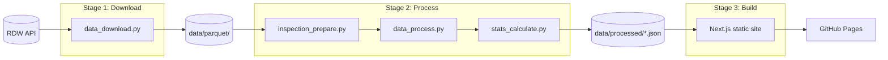

# Automation Contributor Rules

> Dense guidance for automated coding contributors.

## Critical Rule

> [!CAUTION]
> **All frontend data and constants MUST derive from backend JSON.**
> Never hardcode values (filter ranges, fuel types, age brackets, thresholds, labels, etc.) in frontend code. The Python pipeline calculates dynamic values (min/max ranges, lists, thresholds) and writes them to `metadata.json` or other processed JSON files. Frontend must always read from these files.
> If a frontend default cannot be derived from backend JSON, define it in `web/app/lib/defaults.ts` (and nowhere else).

## Architecture


```mermaid
flowchart LR
    subgraph Stage1["Stage 1: Download"]
        DL[data_download.py]
    end
    subgraph Stage2["Stage 2: Process"]
        IP[inspection_prepare.py]
        DP[data_process.py]
        SC[stats_calculate.py]
    end
    subgraph Stage3["Stage 3: Build"]
        WEB[Next.js static site]
    end

    RDW[(RDW API)] --> DL
    DL --> PQ[(data/parquet/)]
    PQ --> IP --> DP --> SC
    SC --> JSON[(data/processed/*.json)]
    JSON --> WEB --> GH[GitHub Pages]
```

**Pipeline discipline**: Stages run sequentially. Stage N must succeed before Stage N+1 runs.

**Stage 2 modules**: `data_process.py` orchestrates Stage 2 and delegates to the helper modules `inspection_prepare.py`, `inspection_stats.py`, `stats_aggregate.py`, `defect_build.py`, and `fuel_build.py`. Shared helpers live in `config.py`, `api_client.py`, `system_utils.py` (memory/filesystem utilities), and `cache_validate.py`.

**Re-run requirement**: After modifying `data_process.py` or any script that changes JSON output, always re-run the pipeline:
```bash
cd scripts && uv run data_process.py
cd ../web && npm run dev  # JSON files sync automatically via predev hook
```

## Project Structure

- `scripts/` — Stage 1-2: Python data pipeline
- `web/` — Stage 3: Next.js static site
- `data/parquet/` — Raw RDW data (gitignored)
- `data/processed/` — JSON for web (gitignored)
- `docs/` — All documentation

### Frontend (`web/app/`)

- `page.tsx` — Homepage
- `data/`, `statistics/`, `defects/`, `fuels/`, `lookup/`, `about/` — Route pages
- `components/` — Reusable UI (sliders, filters, tables, navigation)
- `hooks/` — Data fetching and processing (`useStatisticsData`, `useDefectData`, `useFuelData`, `useUrlSync`)
- `lib/types.ts` — TypeScript interfaces for all JSON data
- `lib/data_load.ts` — JSON fetch utilities
- `lib/statistics_config.ts` — Table column definitions

## Tech Stack

- Python 3.11+ (managed via uv, config in `scripts/`)
- Polars for data processing: LazyFrames (`scan_*`) and native functions are **mandatory**; actively refactor any Python loops or dicts to Polars-native code
- Memory constraint: full dataset cannot fit in memory; always use streaming/lazy processing
- Next.js 16, Tailwind CSS 4.1, Node.js 22+
- `.env` stores the RDW app token; never commit it

## Code Standards

### Naming Convention: `<subject>_<verb>`

- **Files**: `data_download.py`, `stats_calculate.py` *(not `downloadData.py`)*
- **Functions**: `dataset_fetch()`, `json_save()` *(not `fetchDataset()`)*
- **Variables**: `brand_stats`, `model_data` *(not `brandStats`)*

### Rules

- File size: hard cap 500 LOC; split early
- Language: English everywhere except RDW field names (stay Dutch, exactly as provided)
- Python: type hints + docstrings required; format with Ruff before commit
- TypeScript: strict mode, no `any`, no `console.log` in production
- No emojis, no mock data, minimal logging (no timestamps)
- No tool attribution: do not include assistant/tool branding, model names,
  automation signatures, or generated-by language in branch names, commit
  messages, PR titles/bodies, code, docs, comments, UI text, or generated
  artifacts. Use human-readable task names only.

## Linting & Git Hooks

Contributor rules are enforced twice: by **local git hooks** (fast feedback before
commit) and by the **`.github/workflows/checks.yml`** CI workflow (the gate on every
pull request and push to `main`). Each check is one script under `ci/`, invoked
identically by the hooks and by CI, so the two never drift. Fix the underlying
code; never disable rules, add `eslint-disable` comments, or loosen config.

Hooks are auto-wired with zero extra dependencies via the `prepare` script in
`web/package.json` (`git config core.hooksPath .githooks`), which runs on
`npm install`/`npm ci`. As with all client-side hooks, `--no-verify` bypasses them;
CI is the backstop.

**Checks (each runs locally and in CI):**

- **Web lint**: `npm run lint` in `web/` runs `eslint --max-warnings 0`, so any warning
  fails like an error. Local `pre-commit` runs it only when staged files touch `web/`
  (and skips with a notice when `web/node_modules` is missing); CI's `web-lint` job runs
  it when the PR/push changes `web/`.
- **Python lint + format**: `ruff check` and `ruff format` over `scripts/`. The
  `pre-commit` hook auto-formats and re-stages staged `.py` files, then blocks on any
  remaining lint error (skips with a notice when `uv`/`scripts/.venv` is missing); CI's
  `python-lint` job runs `ruff check .` and `ruff format --check .` (check-only, never
  rewrites).
- **File size**: `loc-check.sh` fails any tracked `.py`/`.ts`/`.tsx`/`.js`/`.mjs` over
  the 500-line cap.
- **Charset**: `charset-check.sh` blocks emoji/pictographs across all tracked files and
  ASCII decoration (runs of 4+ repeated separators) in every tracked file except `*.md`
  (Markdown is exempt from the decoration check so tables and rule rows stay easy to
  write). Latin accents and currency symbols are always allowed.
- **No attribution**: `.githooks/commit-msg` and `.githooks/pre-push` reject any commit
  message that references an AI tool or adds a co-authoring credit; CI's `repo-checks`
  job scans the same over the PR/push commit range **and** the PR title and body. The
  shared case-insensitive block-list lives in `ci/attribution-check.sh`
  (claude, codex, copilot, chatgpt, gpt-N, openai, anthropic, gemini, jules, cursor,
  `co-authored-by`, `generated with/by`, the robot emoji).

## Boundaries

**Always:**
- Derive frontend values from backend JSON
- Preserve RDW column names exactly
- Update `docs/data_mapping.md` when using new fields
- Run formatter before commit
- Keep files under 500 LOC

**Ask First:**
- Adding new dependencies
- Major architecture changes
- Modifying CI/CD config

**Never:**
- Hardcode filter ranges, labels, or thresholds in frontend
- Rename/normalize RDW fields
- Commit `.env` or secrets
- Use mock/invented data
- Print date/time in logs

## RDW API

Base URL: `https://opendata.rdw.nl/resource/{id}.json`

- **Gekentekende Voertuigen** (`m9d7-ebf2`)
- **Meldingen Keuringsinstantie** (`sgfe-77wx`)
- **Geconstateerde Gebreken** (`a34c-vvps`)
- **Gebreken** (`hx2c-gt7k`)
- **Brandstof** (`8ys7-d773`)

## Documentation

- `docs/ai-rules.md` — This file: automation guidance, architecture, commands
- `docs/api-limits.md` — RDW rate limits and pagination
- `docs/data_mapping.md` — RDW field names and pipeline output formats
- `docs/metrics.md` — Defect metrics, age brackets, thresholds
- `docs/requirements.md` — Project requirements and acceptance criteria
- `docs/todo.md` — Task tracking (update before/after work)
- `docs/troubleshooting/` — Issue logs: `YYYY-MM-DD_<slug>.md` format

Keep docs current. Priority: update docs before any other work.

## Git Workflow

**Always push changes to a new PR.** Every code change must be submitted via a pull request — never commit directly to `main`.

## Verification Workflow

1. Run changes locally
2. Commit and push to a feature branch
3. Open a pull request
4. Watch GitHub Actions until green
